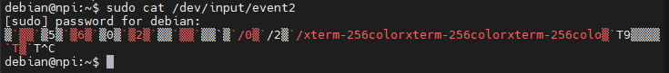

# LVGL移植

## 一、clone仓库

```shell
git clone --recursive git@github.com:YM199/lvgl.git
```

## 二、设置头文件

在工程根目录执行以下语句

```shell
cp lvgl_src/lvgl/lv_conf_template.h lvgl_src/lv_conf.h
cp lvgl_src/lv_drivers/lv_drv_conf_template.h lvgl_src/lv_drv_conf.h
```

### lv_conf.h

```c
#if 0 改为 #if 1
```

将lv_conf.h的`\#define LV_COLOR_DEPTH   32`改为`\#define LV_COLOR_DEPTH   16`
注意：这里对应自己显示器的硬件配置。比如我的显示器是16的（RGB565）。

```c
#define LV_USE_PERF_MONITOR 1 /*显示 FPS 和 CPU*/
```

### lv_drv_conf.h

```c
#if 0 改为 #if 1
```

添加宏定义：

```C
#define LV_LVGL_H_INCLUDE_SIMPLE 1
```

```C
#  define USE_FBDEV 1 /*改为1 使用framebuffer为/dev/fb0*/
#  define USE_EVDEV 1 /*改为1 打开输入，使用/dev/input/event2*/
```

>具体是哪个设备就改为哪个设备

你的板子的输入事件可能不是event1，根据实际进行修改。可以使用cat命令来测试一下你板子的触摸屏输入对应的是哪一个event，如：



此时，触摸一下屏幕，则终端会有信息（乱码信息）输出，则说明当前板子的触摸输入对应的就是这个event。

## CMake的修改

lvgl_src/lvgl/env_support/cmake/custom.cmake

注释掉如下部分:

```text
#target_compile_definitions(
#  lvgl PUBLIC $<$<BOOL:${LV_LVGL_H_INCLUDE_SIMPLE}>:LV_LVGL_H_INCLUDE_SIMPLE>
#              $<$<BOOL:${LV_CONF_INCLUDE_SIMPLE}>:LV_CONF_INCLUDE_SIMPLE>)
```

lvgl_src/lvgl/CMakeLists.txt

注释掉如下部分:

```text
if(NOT ESP_PLATFORM)
  #project(lvgl HOMEPAGE_URL https://github.com/lvgl/lvgl)
endif()
```

lvgl_src/lv_drivers/CMakeLists.txt

注释掉如下部分:

```text
#project(lv_drivers HOMEPAGE_URL https://github.com/lvgl/lv_drivers/)
```
